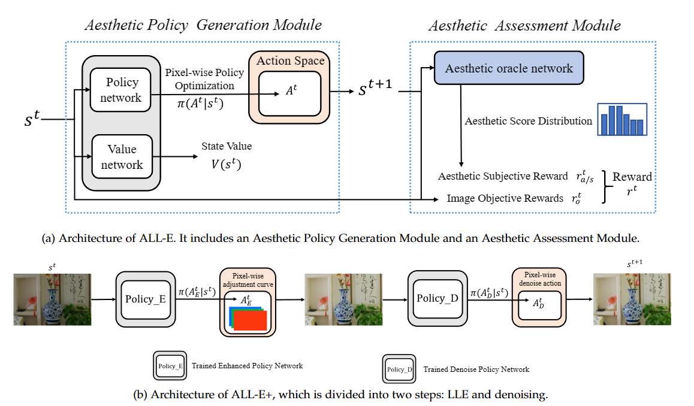

# ALL-E+: Aesthetics-guided Low-Level Image Enhancement

You can find more details here: https://dongl-group.github.io/project_pages/ALLE+.html

You can find the details of our IJCAI version: https://dongl-group.github.io/project_pages/ALLE.html

## Architecture

## Requirement
* Python 3.5+
* Chainer 5.0+
* Cupy 5.0+
* OpenCV 3.4+
* Torch 1.6

You can install the required libraries by the command `pip install -r requirements.txt`.


## Usage
### Training
If you want to train the model

1. download the LOL dataset or your own dataset
2. 
```
python train.py  # using NIMA model
python train_TANet.py  # using TANet model
```

### Testing with pretrained models

If you want to use FFDNet as a denoising module for testing:

```
python test_df.py
```

If you want to use our denoising module for testing:

```
python test_d.py
```

If you want to test without using the denoising module:

```
python test_oe.py
```

